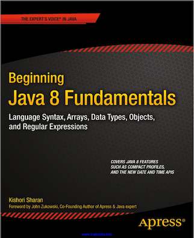

# BeginningJava8Fundamentals
Exercises and examples of the book Beginning Java 8 Fundamentals, Author Kishori Sharan.

This book takes a focused approach to learning the fundamentals of the Java platform.

